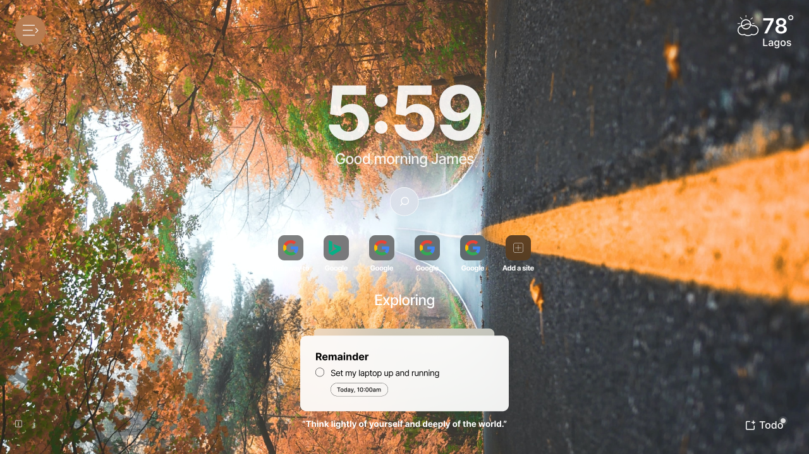

  

<h1 align="center">Paige Browser Extension</h1>

<h3 align="center">
  An open source browser extension , made by Devmotion.
</h3>

<h3 align="center">a space where you can customize your focus, immerse yourself in calm scenes, and find inspiration whenever you open a new tab in your browser</h3>

  

### ✨ Features

- [x] Customizable theme💅
- [x] Customizable Background image🖼️
- [x] Customizable Navigation🧭
- [x] Todo📝
- [x] Daily Motivation💪
- [x]  Expanded color theme🧑‍🎨
- [x] Background image change and preview 🖼️
- [x] Cache image requests with service workers 🧺
- [x] Search🔍
- [ ] Todo Reminder⌚

### 📋 Requirements

1. a chromium-based browser e.g. Chrome, Edge, etc.

### 🛠️ Setup

1. Download v1.50.zip and unzip
2. unpack the folder in your Chrome browser's `chrome://extensions` URL. You can follow this [tutorial](https://developer.chrome.com/docs/extensions/mv3/getstarted/)  as a guide
3. Enjoy💯
